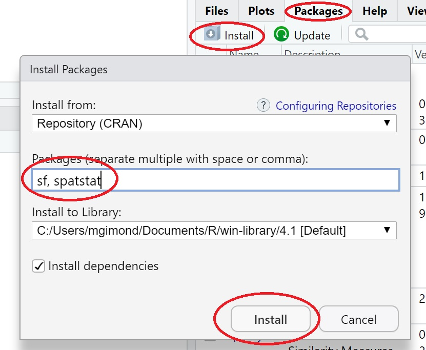
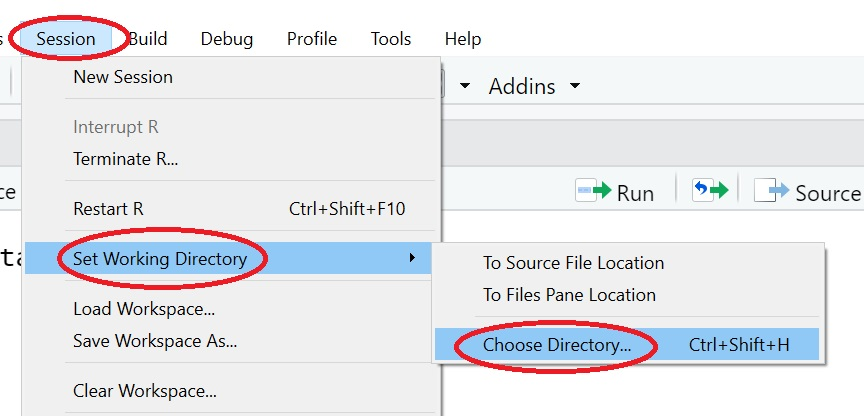
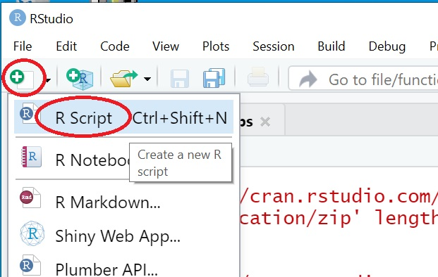
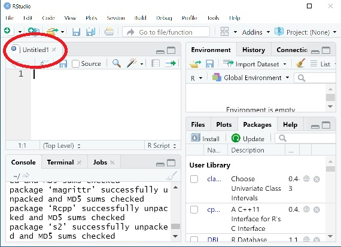
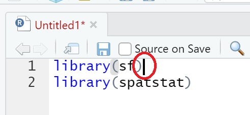
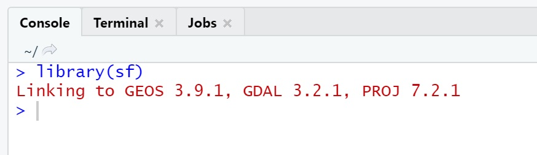
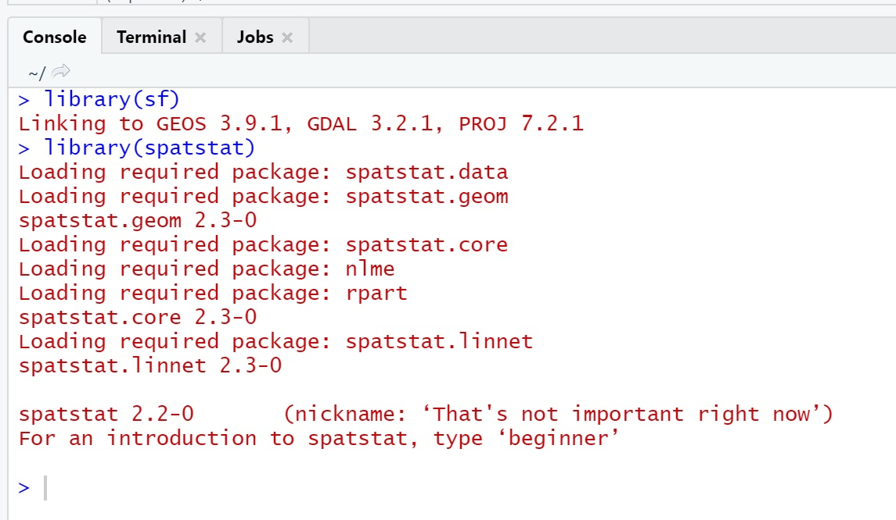
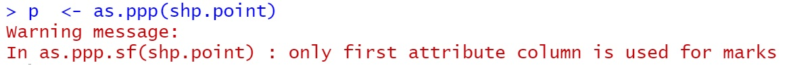

```{r setup, include=FALSE}
knitr::opts_chunk$set(echo = TRUE, message = FALSE, warning=FALSE, results="hide", tidy=FALSE )
```

------------------------------------------------------------------------

> Data for this tutorial can be downloaded [here](https://github.com/mgimond/es214_support_tutorials/raw/main/Intro_to_point_patterns/bei.zip).

# R vs RStudio


R is a data analysis environment. RStudio is a desktop interface to R (sometimes referred to as an integrated development environment-or IDE for short). Unlike most desktop environments you have been exposed to so far, R does not take instructions from a point-and-click environment, its instructions are provided by simple lines of text.

In this course, we will make use of RStudio to run R code. To access RStudio from a lab computer, simply click on the Windows Start icon in the lower left-hand corner and select RStudio.

You are also free to install R and RStudio on your personal computers if you want to work on your own computer (this may be userful for those of you living downtown).

For this exercise and subsequent R exercises in this course, **DO NOT** use the RStudio server (the web based RStudio) you may have used in other courses. The server uses an older version of R and may not allow you to successfully install packages needed in this course.


# Setting up the R/RStudio environment


## Installing packages

This R session will make use of two packages: `spatstat` which has all of the point analysis tools used in this course and `sf` which is used to load and manipulate GIS files.

You can install packages in one of two ways: via command line or via the RStudio interface.

### Option 1: Command line

```{r eval=FALSE}
install.packages("sf")
install.packages("spatstat")
```

### Option 2: RStudio interface

{width="394"}


## Setting an R session's workspace

If you plan to read or write files from/to a directory, you will need  to explicitly define the R session's project folder. To set a session's working directory, go to **Session \>\> Set Working Directory \>\> Choose Directory**. In this example, you would set the working directory to your *HW15* folder if this is where you have your shapefiles stored.

{width="409"}

## Opening a new R script


R can be run interacively through the console. But when typing multiple lines of code, it's best to create a new R script that you will be able to save to your project folder. To open an empty R script in RStudio, click on the upper-left icon and select `R Script`.


{width="242"} 

This will add a new R script in the upper-left pane of your desktop environment.

{width="242"}

R scripts are usually saved via the `File >> Save As ...` menu with the .R extension (e.g. `HW15.R`). Make sure to save this script on a regular basis as you add/modify pieces of code.


## Loading (activating) packages

Installing packages under your user profile is a one-time process, but to access the package contents in a current R session you must explicitly load its contents via the `library` function. 

In the empty script, type the following lines of code:

```{r}
library(sf)
library(spatstat)
```

Typing commands in the R script will not automatically execute those scripts it is best to execute each line one at a time, even if you have multiple lines of code. Running each line one at the time makes it easier to troubleshoot your script.

Place the cursor anywhere on the first line of code (usually at the end of the line).

{width="242"}

Next, type the keys `Ctrl` + `Enter` on your Windows keyboard. If you are using a Mac, the shortcut key is `Cmd` + `Return`.

Everytime you execute a command, some text will appear in the console pane. Here, you shoudl see a few lines inidicating that the package (and its dependencies) were properly loaded. Do not be alarmed by the red text color. This id the default color used by RStudio to show output from a command.

{width="300"}

If you get an error message indicating that the package cannot be found, check that you properly typed the function and package name and that you properly installed the package as outlined in an earlier step.

Now execute the second line of code by typing `Ctrl` + `Enter` (or `Cmd` + `Return` on a Mac). Make sure that the cursor is already on that line before executing. 

You should see the following output:

{width="400"}

Going forward, every time you type a new set of instructions in the script, follow-up with a `Ctrl` + `Enter` to have R execute the code.

# Loading GIS data into R

## Loading shapefiles

The `sf` package we just loaded will allow R to read shapefiles.

First, we will load the `extent.shp` polygon shapefile into R and save the contents of that shapefile in an object called `shp.extent`. Note the use of the assignment operator `<-` which *assigns* the output to its right, to the object to its left. The name of the shapefile must end with the `*.shp` extension, but note that the function understands that the shapefile consists of multiple files.

```{r}
shp.extent <- st_read("extent.shp")
```

You should see the following output in the console:

```
> shp.extent <- st_read("extent.shp")
Reading layer `extent' from data source 
  `C:\Users\mgimond\Documents\es214\HW15\extent.shp' using driver `ESRI Shapefile'
Simple feature collection with 1 feature and 1 field
Geometry type: POLYGON
Dimension:     XY
Bounding box:  xmin: 625816.3 ymin: 1011809 xmax: 626816.3 ymax: 1012309
Projected CRS: WGS 84 / UTM zone 17N
```

> NOTE: if you get the error message `Error: Cannot open "extent.shp"; The file doesn't seem to exist.`, then you probably did not properly set the working directory in an earlier step or you have a syntax error in the filename.

R can store spatial objects in different internal formats but `spatstat`'s functions require that specific spatial formats be used. The `extent.shp`  layer will be used to define the study extent which will require that it be stored as a `owin` data type for use with the `spatstat` package. We will make use of the `as.owin` function to convert the `shp.extent` object to an `owin` object. We'll name the output object `w`.

```{r}
w  <- as.owin(shp.extent)
```

Note that the coordinate unit associated with the spatial object inherits the underlying coordinate system's map units--`meters` in our example. 

Next we will load the `bei.shp` using the same function, but instead of storing the shapefile as a polygon boundary, we will convert the point shapefile to a `ppp` point object for use with the `spatstat` package.

```{r}
shp.point <- st_read("bei.shp")  
p  <- as.ppp(shp.point)  
```

Note that you might see the following warning. This is fine.

{width="340"}

Next, we will need to explicitly define the study extent for the point object. This will prove useful when running the kernel density function later in this exercise. 

```{r}
Window(p) <- w
```

There is one more thing that we will need to do that will make the data behave with `spatstats` tools: remove the layer's attribute information (point attributes are also known as *marks* in the point pattern analysis world). The point attributes will not be needed here since our interest is in the pattern generated by the points and not by their attribute values.

```{r}
marks(p) <- NULL
```

# Visualizing Spatial Objects

There are several tools that can be used to plot the points. The  base `plot` function does a nice job in generating basic plots. To plot the point data we just loaded, simply type:

```{r fig.height = 2, fig.width = 3, echo = 2}
OP <- par(mar = c(0,0,0,0))
plot(p, main = NULL)
par(OP)
```

You can customize some aspects of the plot such as point type (`pch` parameter), size (`cex` parameter) and color (`cols` parameter).

```{r fig.height = 2, fig.width = 3, echo = 2}
OP <- par(mar = c(0,0,0,0))
plot(p, main = NULL, pch = 16, cex = 0.6, cols = "brown")
par(OP)
```

# Localized (Kernel) Density

Next, we'll create a kernel density raster where the output cell value with take on the point density for a search radius defined by a 20 meter radius (`sigma = 20`). We will use the default *Gaussian* kernel which assigns greater weights to points closest to the raster cell whose density value is being computed. 

```{r}
k.gaus <- density(p, sigma = 20, window = "gaussian")
```

Now, lets plot the density layer.

```{r fig.height = 2, fig.width=3, echo=2}
OP <- par(mar = c(0,0,0,2))
plot(k.gaus, main = NULL)
par(OP)
```

The `main = NULL` option suppresses the printing of the title above the map.

You'll notice that "extent" defaults to that of the point layer's boundary extent (recall that when we loaded the point shapefile, we explicitly set the point layers' extent to that of the `extent.shp` layer using the code `Window(p) <- w`). This saves us from having to clip out the raster using the extent boundary.

By default, the `spatstat` package creates `128 x 128` rasters. You can modify the raster resolution using the `spatstat.options()` function. But unlike ArcGIS, you can't specify the pixel size, instead, you must specify the number of rows and columns. Given that we have an extent roughly equal to 1000 (wide) by 500 (tall), we can set the resolution to `500x250` if we want pixel sizes around 10 meters in size.


```{r fig.height = 2, fig.width=3, echo=2:4}
OP <- par(mar = c(0,0,0,2))
spatstat.options(npixel=c(500, 250))
k.gaus <- density(p, sigma = 20, window = "gaussian")
plot(k.gaus, main = NULL)
par(OP)
```

Customizing raster colors with the base plot function is a bit more involved. We'll modify the current color scheme using a built-in color gradient that ranges from light yellow to dark red (`heat.colors`),

```{r fig.height = 2, fig.width=3, echo = 2}
OP <- par(mar = c(0,0,0,2))
plot(k.gaus, col = heat.colors(n = 50, rev = TRUE), main = NULL)
par(OP)
```

The `n = 100` parameter gives the function the number of unique colors  to generate. Given that we want a continuous palette, any value larger than 50 should be fine (recall that we cannot discern large ranges of unique colors).

### Other kernel choices

If you want to replicate ArcGIS's **Kernel density** geoprocess you need to set the kernel to `quartic` (i.e. `kernel = "quartic"`).

```{r fig.height = 2, fig.width=3, echo = 2:3}
OP <- par(mar = c(0,0,0,2))
k.quartic <- density(p, sigma = 20 , kernel = "quartic")
plot(k.quartic, col = heat.colors(n = 50, rev = TRUE), main = NULL)
par(OP)
```

To replicate ArcGIS's **Point density** function set the window to `rectangular`. Note that we do not use the `kernel = ` parameter for the `rectangular` option. Instead, we use the `window = ` parameter.

```{r fig.height = 2, fig.width=3, echo= 2:3}
OP <- par(mar = c(0,0,0,2))
k.rect <- density(p, sigma = 20, window = "rectangular")
plot(k.rect, col = heat.colors(n = 50, rev = TRUE), main = NULL)
par(OP)
```


# Distance Based

## Nearest Neighbor Distance (first neighbor)

We can compute the average nearest neighbor distance for all points using the `nndist` function. This function will compute the distances between all closest point pairs. The `mean` function computes the average value from all those distance values. Note that the units are in map units (meters in our example).

```{r, results='markup'}
mean( nndist(p, k=1) )
```

## Multi-order Neighbor Distance (optional exercise)

To make things more interesting, we can compute the average distance to *all* order neighbors, then plot the relationship as follows. Note that this command may take a while to execute (30 to 60 seconds).

```{r fig.width=6, fig.height=4}
ANN <- apply(nndist(p, k=1:npoints(p)),2 , FUN=mean)
```

We can plot the output using one of the following syntax:

```{r fig.width=6, fig.height=4, eval=FALSE}
plot(1:npoints(p), ANN, type="b", xlab="Neighbor order" )
```

Or, you can type

```{r fig.width=6, fig.height=4}
plot(ANN ~ eval(1:npoints(p)), type="b", xlab="Neighbor order" )
```
